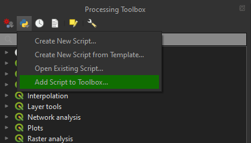

# CEMAN’s QGIS Algorithms

Collection of custom QGIS processing algorithms, scripts, and models.

* Extract shoreline (depends on Otsu’s binarization)
* Otsu’s binarization

In order to install the algorithms, download this repository and add the scripts to the QGIS processing toolbox: _Add Script to Toolbox..._

You are free to use these algorithms for your projects. Also, remember to use the batch processing interface in QGIS if you have to process large amounts of data.
